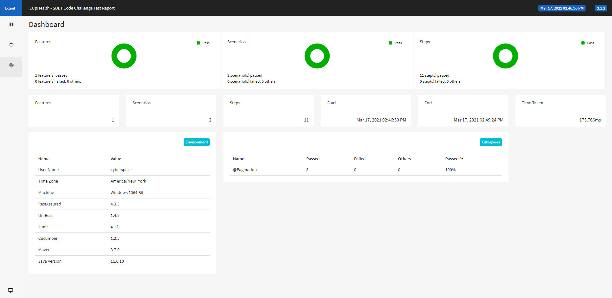

#1upHealth SDET Coding Challenge

##What about this framework?
Data-Driven and Behaviour-Driven framework to write automated test cases for web services with more focus on business.
Have an interactive graphical html report.

##Used Tools and Frameworks:-
- Java v11.0.10
- Rest-Assured v4.3.3
- UniRest v1.4.9
- Cucumber and Gherkin  v1.2.5
- JUnit v4.12
- Extent Report v3.1.2
- Maven v3.7.0

##Folder Structure:-
- src/test/java
    - runners Folder - TestRunner.java [This is the driver file - All the Tags , feature folder and glue folder is present in this, Also the information about Reporting Plugin]
    - stepDefinitions Folder - Steps.java [This is the step definitions file - All tghe steps that have been written in the feature file are present here]
    - configs Folder - extent-config.xml [This is the Report configuration file]
    - properties Folder - BaseProperties.java [This file is to store common properties of the project]

- src/test/resources
    - features Folder - codeTest.feature [This is testcase file. All the test scenario has been written using Gherkin language]

- target
    - cucumber-html-reports Folder - ExtentReport.html [This is the Interactive Extent Report File]
    - cucumber-json-reports Folder - Cucumber.json [This is the JSON Report File]  
    - cucumber-xml-reports Folder - Cucumber.xml [This is the XML Report File]

##Prerequisites:-
 - Java to be installed and should be present (v11.0.10 Recommended)
 - Maven to be installed and should be present (v3.7.0 Recommended)
 - Intellij Idea/Eclipse plugin not mandatory but to show the color highlighted for gherkins

##Execution :-
- Clone the repo to the local machine
- Feature File can be run directly - codeTest.feature file from IDE

- Runner Can be used to run multiple Feature file at 1 go based on the Tags.

- From Command Line 
    - Go to the project directory
    - Run: mvn clean test 
    